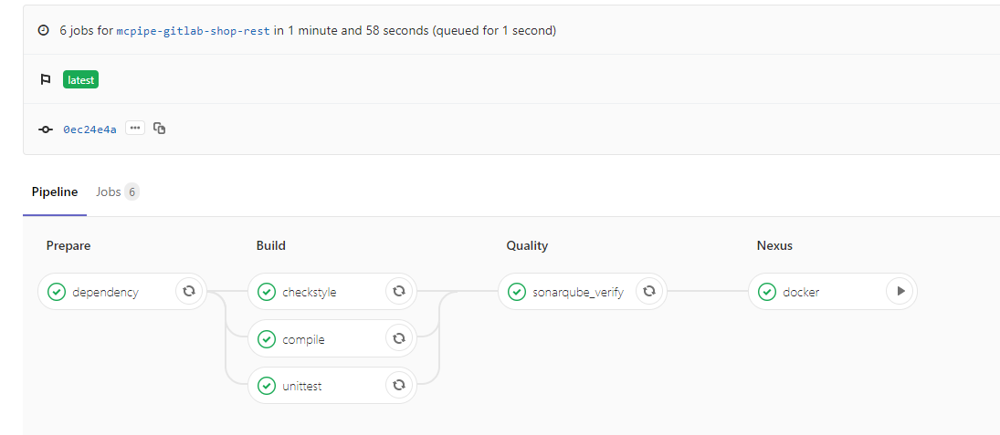
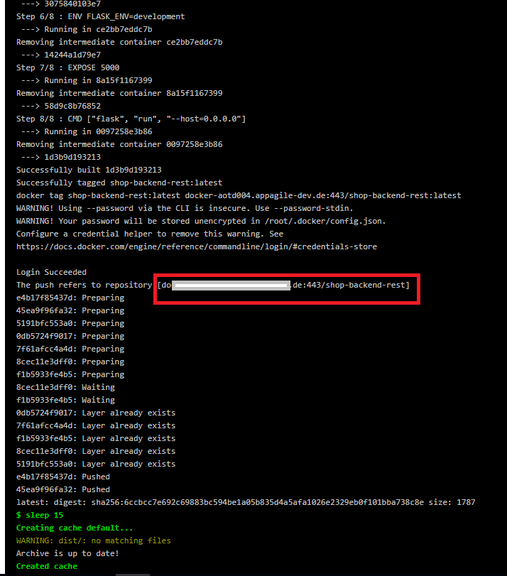
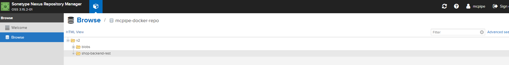

= McPipe's registry

McPipe includes Nexus registry as a centralized repository for managing resulting artifacts of the pipeline. Details about the Nexus can be obtained from https://www.sonatype.com/nexus-repository-oss[here].

Usually nexus stage is the last stage in the pipeline: 

=== Configuration

As previous stages, Nexus stage is also defined in the .gitlab-ci.yml file and uses the benefits of the maketool: 

[source, yaml]
....
docker:
  # image: registry.appagile.io:443/service-paas-images/docker-openshift-cli:latest
  image: docker:stable
  services:
    - docker:dind
  variables:
    # When using dind service we need to instruct docker, to talk with the
    # daemon started inside of the service. The daemon is available with
    # a network connection instead of the default /var/run/docker.sock socket.
    #
    # The 'docker' hostname is the alias of the service container as described at
    # https://docs.gitlab.com/ee/ci/docker/using_docker_images.html#accessing-the-services
    #
    # Note that if you're using Kubernetes executor, the variable should be set to
    # tcp://localhost:2375 because of how Kubernetes executor connects services
    # to the job container
    DOCKER_HOST: tcp://localhost:2375/
    # When using dind, it's wise to use the overlayfs driver for
    # improved performance.
    DOCKER_DRIVER: overlay2
  before_script:
    - apk add --update make bash
    - cd $CI_PROJECT_DIR/docker
    - export RELEASE_TAG=$CI_PROJECT_NAME-$CI_COMMIT_REF_NAME-Build_$CI_JOB_ID
    - docker info
  stage: nexus
  tags:
  script:
    - make docker
    - sleep 15
  when: manual

....

The Nexus stage docker job will execute docker build steps. Since the job itself is running as docker image container, the docker build will be executed inside of a docker container, aka docker-inside-docker build run.

From user perspective it does not require any additiobal configuration step. 

Makefile, usually from docker sub-folder will invoke the pre-build steps, docker build step and finally the image tag and put to the nexus registry.

URL and the credentials for the Nexus are available in the form of the ENVIRONMENT vraiables of the McPipe gitlab, on repository group level:

....
MCPIPE_REGISTRY_SERVER
MCPIPE_REGISTRY_TOKEN
MCPIPE_REGISTRY_USER
....

Details are also on the McPipe deployment summary.

After the image is pushed to the Nexus repository, Nexus UI can be used for managing the pushed artifacts. The Nexus credentials are also available in the form of McPipe's enviromental variables and also in  the McPipe deployment summary.

....
MCPIPE_NEXUS_URL
MCPIPE_NEXUS_USER
MCPIPE_NEXUS_PWD
....

NOTE: By default, the Nexus stage is configured to be run as manual step in the Pipeline. This can be changed in the .gitlab-ci.yml file, Nexus stage, docker job:

[source, yaml]
....

  script:
    - make docker
    - sleep 15
  when: manual
....

